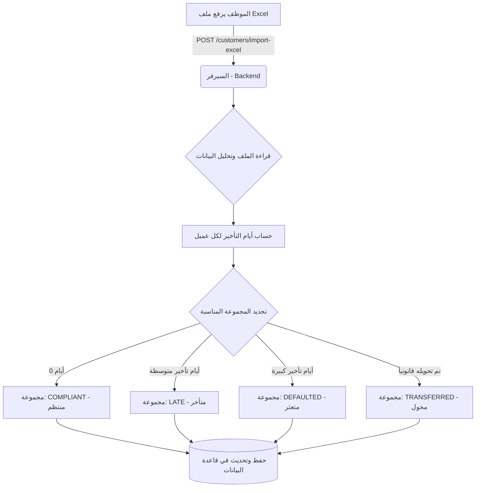
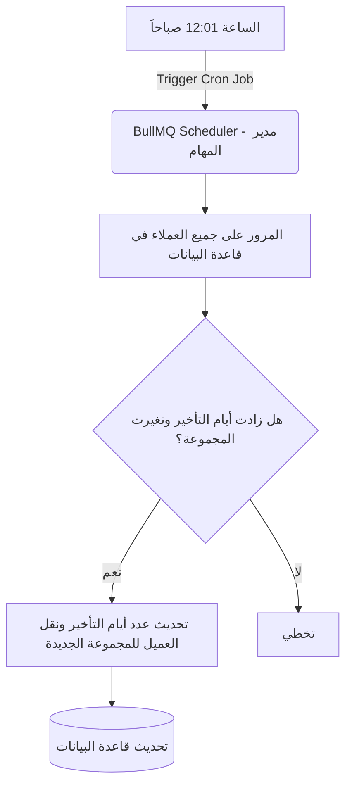
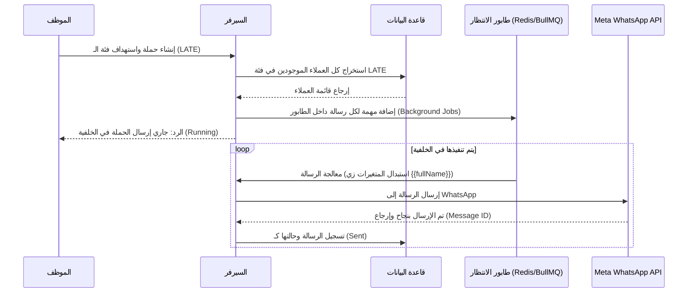
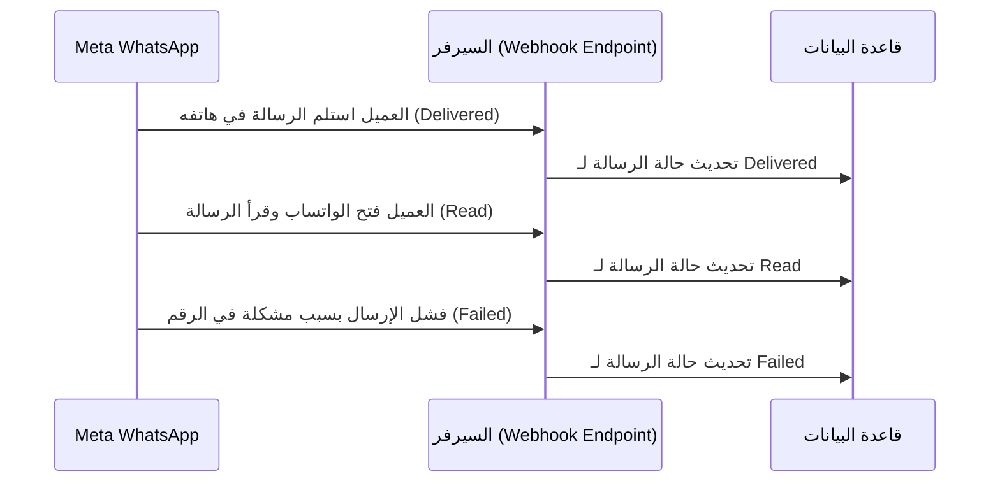
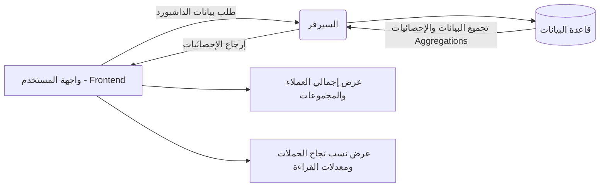
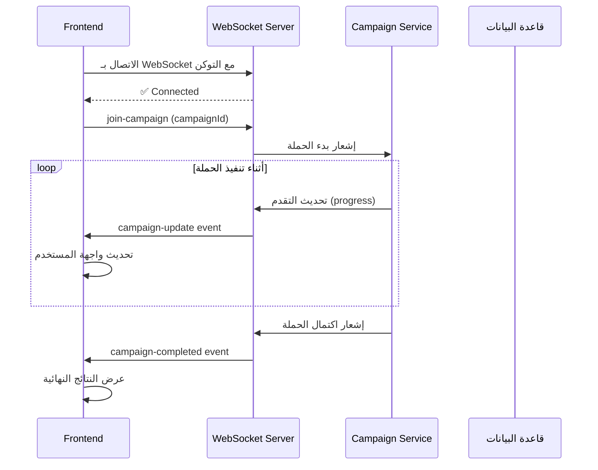
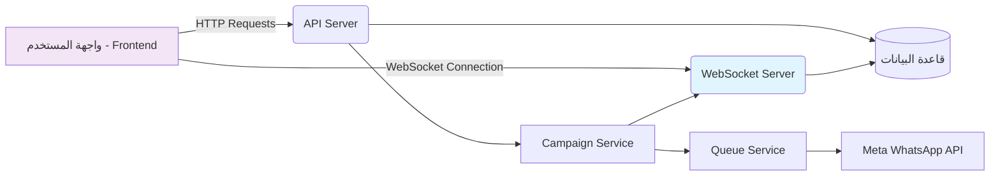

# 🔄 دورة حياة النظام (System Workflow) - BankReach

هذا الملف يشرح دورة عمل نظام **BankReach** بشكل مبسط وسهل الفهم مع رسومات توضيحية (Diagrams) لتوضيح كيفية ترابط أجزاء النظام ببعضها البعض وكيف تتدفق البيانات داخله.

---

## 1. استيراد وتصنيف العملاء (Customer Import & Categorization)

عندما يقوم الموظف برفع ملف الإكسل الذي يحتوي على بيانات العملاء، يمر الملف بعدة مراحل ليتم قراءته وتحليل البيانات، ثم حساب أيام التأخير لكل عميل بناءً على تاريخ استحقاق القسط، وتصنيفه تلقائياً في المجموعة المناسبة.



---

## 2. التحديث اليومي التلقائي (Daily Scheduled Job)

يحتوي النظام على مهمة مجدولة (Cron Job) تعمل يومياً بعد منتصف الليل تلقائياً. هدفها هو ضمان بقاء بيانات أيام التأخير وتصنيفات العملاء مُحدثة بشكل يومي دون أي تدخل بشري.



---

## 3. إرسال حملات الواتساب (WhatsApp Campaigns Workflow)

هذا هو قلب النظام! تبدأ العملية عندما ينشئ الموظف حملة ويختار الفئة المستهدفة، ثم يمر الأمر عبر طوابير الانتظار (Queues) لضمان إرسال آلاف الرسائل دون توقف السيرفر، وينتهي بإرسال الرسائل لـ Meta (WhatsApp).



---

## 4. تتبع حالة الرسائل عبر الـ Webhooks

بعد إرسال الرسائل، نحتاج لمعرفة هل العميل استلم الرسالة وقرأها أم لا. هنا يأتي دور الـ Webhooks، حيث تقوم شركة Meta بإرسال تحديثات تلقائية للسيرفر بحالة كل رسالة.



---

## 5. لوحة التحكم والتقارير (Reports & Dashboard)

يعتمد مديرو النظام والموظفون على إحصائيات لوحة التحكم لمتابعة كفاءة الحملات، والتي يتم تجميعها بسرعة من قاعدة البيانات.



---

## ملخص التقنيات المستخدمة للقيام بهذا العمل (Tech Stack)

* **Node.js, Express.js, TypeScript:** لبناء واجهة برمجية قوية وآمنة وسريعة.
* **MongoDB & Mongoose:** لتخزين بيانات العملاء والقوالب والحملات بمرونة عالية، مما يسهل البحث والتصفية.
* **Redis & BullMQ:** لإدارة طوابير إرسال الرسائل (Message Queues) والمهام المجدولة (Cron Jobs) في الخلفية، مما يضمن أداء سريع للسيرفر حتى مع إرسال آلاف الرسائل.
* **ExcelJS:** لقراءة ملفات الإكسل واستخراج بيانات العملاء منها بكفاءة.
* **Zod:** للتحقق من صحة جميع البيانات المُدخلة من الواجهة الأمامية أو من ملفات الإكسل.
* **Socket.io:** لتحديثات الحملات اللحظية عبر WebSocket.

---

## 6. تحديثات الحملات اللحظية عبر WebSocket

تم إضافة WebSocket server إلى النظام لتمكين تحديثات الحملات لحظيًا. يتيح ذلك للمستخدمين رؤية تقدم الحملات في الوقت الفعلي دون الحاجة لتحديث الصفحة.

### 6.1 تدفق عمل WebSocket



### 6.2 أحداث WebSocket المتاحة

| الحدث | الوصف | متى يتم إرساله |
|-------|-------|----------------|
| `campaign-update` | تحديث لحملة محددة | عند بدء/تقدم/اكتمال/خطأ الحملة |
| `campaign-global-update` | تحديث عام لجميع الحملات | عند أي تغيير في أي حملة |
| `campaign-stats` | إحصائيات الحملة | عند اكتمال الحملة أو طلب الإحصائيات |

### 6.3 هيكل بيانات التحديث

```javascript
{
  campaignId: "6a3e221f3414a3e08c59f790",
  status: "in-progress", // started, in-progress, completed, error
  progress: {
    total: 100,      // إجمالي العملاء المستهدفين
    processed: 45,   // عدد العملاء الذين تم معالجتهم
    sent: 40,        // عدد الرسائل المرسلة بنجاح
    failed: 5        // عدد الرسائل الفاشلة
  },
  message: "جاري إرسال الرسائل...",
  timestamp: "2026-06-26T08:30:00Z"
}
```

### 6.4 مثال للاستخدام في Frontend

```javascript
// 1. الاتصال بـ WebSocket
const socket = io('https://your-server.com', {
  transports: ['websocket', 'polling'],
  auth: { token: 'jwt-token' }
});

// 2. الانضمام لغرفة الحملة
socket.emit('join-campaign', 'campaign-id-123');

// 3. الاستماع للتحديثات
socket.on('campaign-update', (data) => {
  console.log('تحديث الحملة:', data);
  
  // تحديث واجهة المستخدم بناءً على الحالة
  switch(data.status) {
    case 'started':
      showNotification(`بدأت الحملة: ${data.message}`);
      break;
    case 'in-progress':
      updateProgressBar(data.progress);
      break;
    case 'completed':
      showSuccess(`اكتملت الحملة بنجاح!`);
      break;
    case 'error':
      showError(`حدث خطأ: ${data.message}`);
      break;
  }
});

// 4. الاستماع للإحصائيات
socket.on('campaign-stats', (stats) => {
  updateCharts(stats);
});
```

### 6.5 فوائد WebSocket في النظام

1. **تجربة مستخدم محسنة**: تحديثات لحظية دون الحاجة لتحديث الصفحة
2. **مراقبة أفضل**: متابعة تقدم الحملات في الوقت الفعلي
3. **كفاءة عالية**: اتصال واحد لجميع التحديثات
4. **قابلية التوسع**: دعم آلاف المستخدمين المتصلين في نفس الوقت

### 6.6 التكامل مع النظام الحالي



### 6.7 ملفات التوثيق والأمثلة

- `src/websocket/websocket-client-example.js` - مثال كامل للاستخدام
- `src/websocket/WEBSOCKET_API.md` - توثيق مفصل للـ API
- `README.md#8` - دليل التكامل مع Frontend
